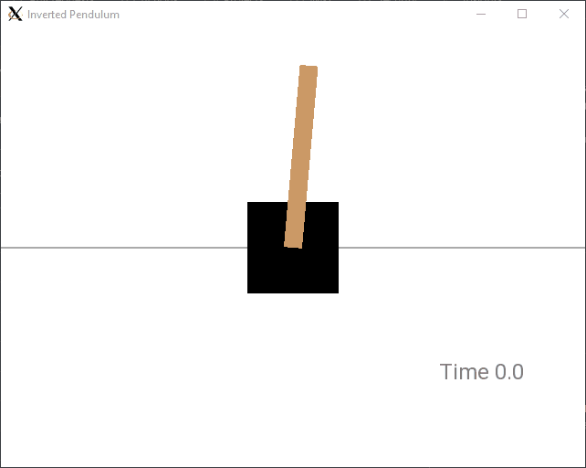
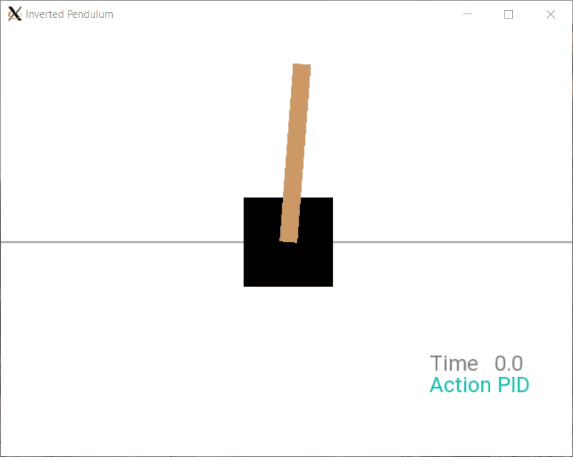

# Inverted Pendulum

A simple simulator to test control algorithms in C++

  

    Inverted pendulum in open-loop

  

    Inverted pendulum in closed-loop with PID

  

    Inverted pendulum in closed-loop with LQR

## Notes
This simulator is being developed on Ubuntu using the Windows Subsystem for Linux (WSL)

## Dependencies
- cmake
- make
- gcc/g++
- [eigen](https://eigen.tuxfamily.org/index.php?title=Main_Page) (included)
- [sfml](https://www.sfml-dev.org/)
- [googletest](https://github.com/google/googletest) (optional)
- [sciplot](https://github.com/sciplot/sciplot) (optional)

## Build Instructions
1. Clone this repo.
2. Make a build directory: `mkdir build && cd build`
3. Compile: `cmake .. && make`
4. Run it: `./cartpole`

## Guidelines
- [Google's C++ style guide](https://google.github.io/styleguide/cppguide.html)
- [Udacity Git Commit Message Style Guide](http://udacity.github.io/git-styleguide/)

## References
### Projects
- [CartPole-v1](https://gym.openai.com/envs/CartPole-v1/)
- [Riccati_Solver](https://github.com/TakaHoribe/Riccati_Solver)
### Tutorials
- [Install WSL on Windows 10](https://www.howtogeek.com/249966/how-to-install-and-use-the-linux-bash-shell-on-windows-10/)
- [Install SFML in Linux](https://www.sfml-dev.org/tutorials/2.5/start-linux.php)
- [Install sciplot](https://sciplot.github.io/installation/)
- [Build googletest](https://github.com/google/googletest/blob/master/googletest/README.md)
### Books
- Åström, K. J., & Murray, R. M. (2021). *Feedback systems: An introduction for scientists and engineers* (2nd ed.). Princeton University Press. ([online](https://fbswiki.org/wiki/index.php/Feedback_Systems:_An_Introduction_for_Scientists_and_Engineers))