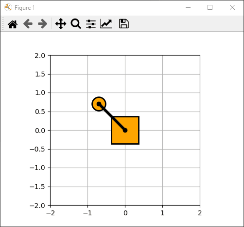

# Inverted Pendulum

This project simulates an inverted pendulum in C++

## Visualizer

This project contains a simple visualizer written in Python. The visualizer reads the simulation data from a CSV file. 

Here's an example of the output:

